# User

## User Registration Flow
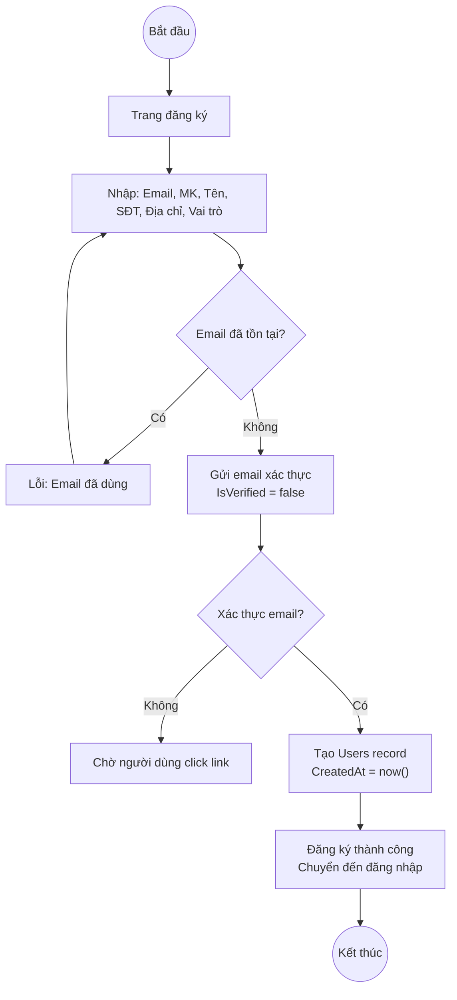

## User Login Flow
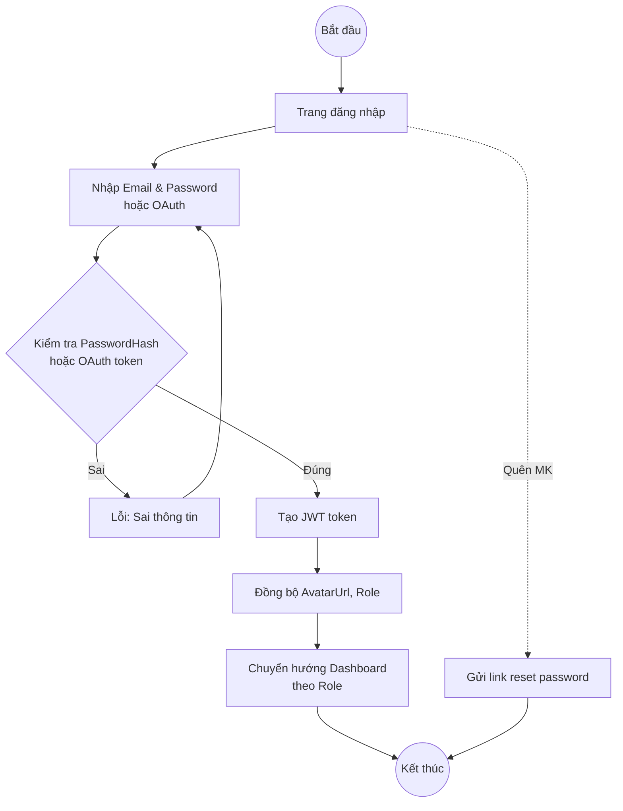

## Payment Processing Flow
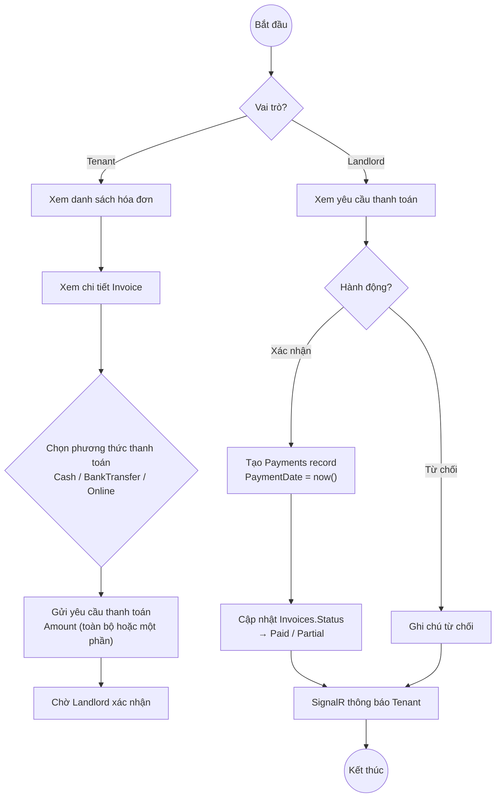

# Landlord

## Create Area Flow
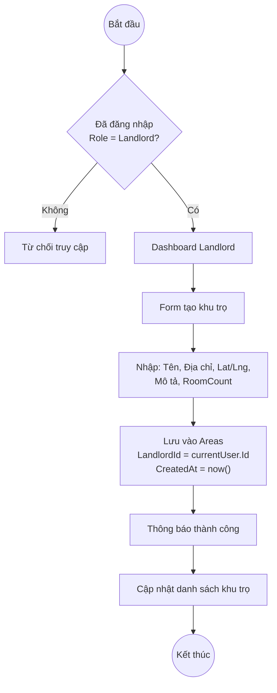

## Manage Property Flow
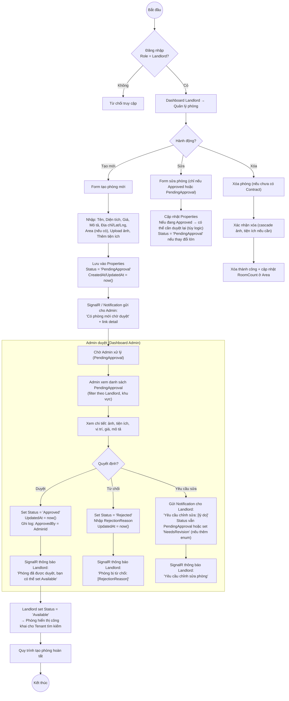

## Create Contract Flow
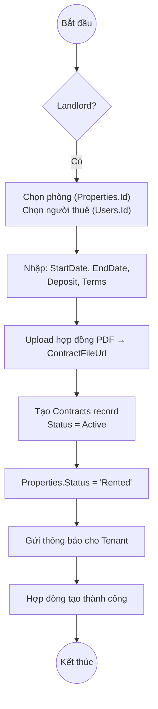

## Manage Invoice Flow
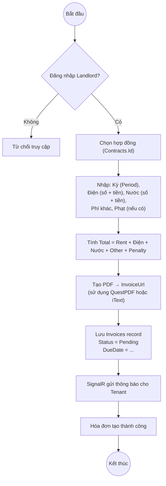

## Revenue Statistics Flow
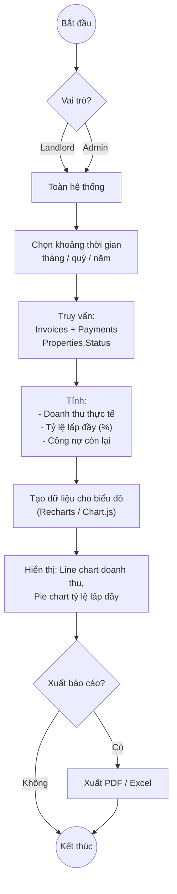

# Tenant

## Search Properties Flow
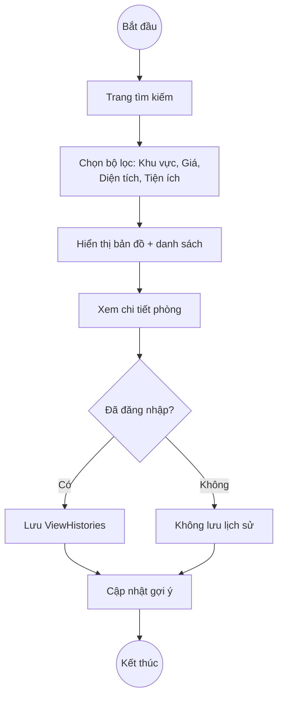

## Schedule Appointment Flow
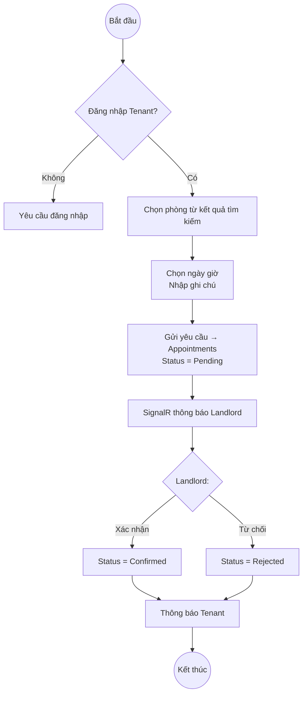

# System

## Recommendation Flow
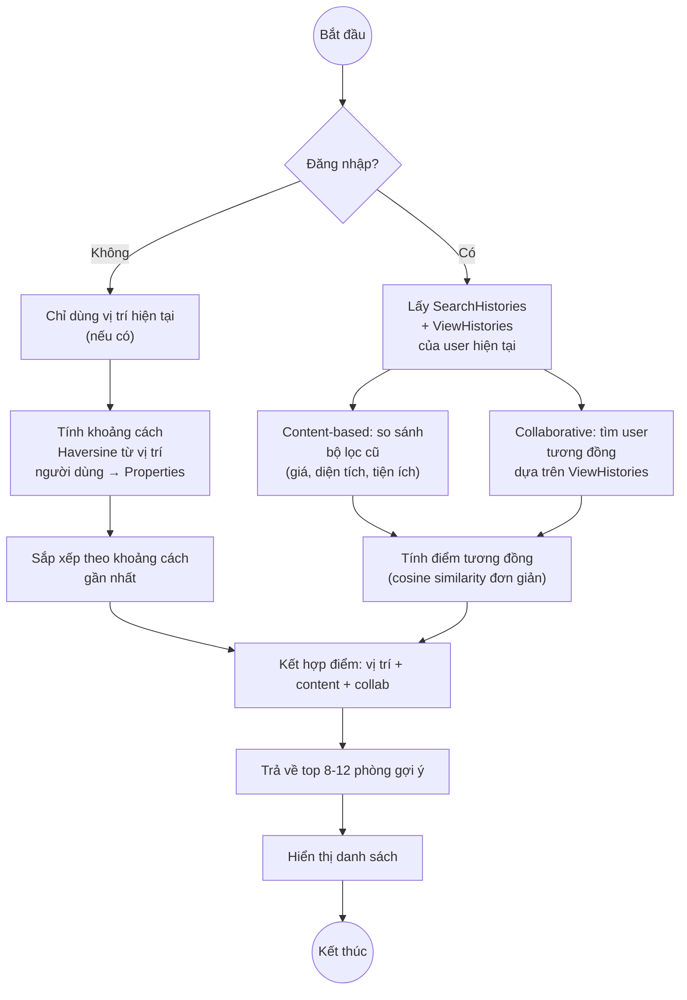

## Notification Flow (System + Admin)
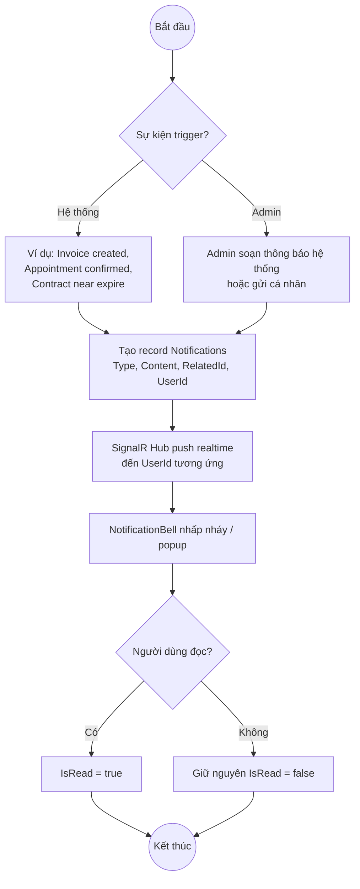

# Admin

## Admin Manage Users Flow
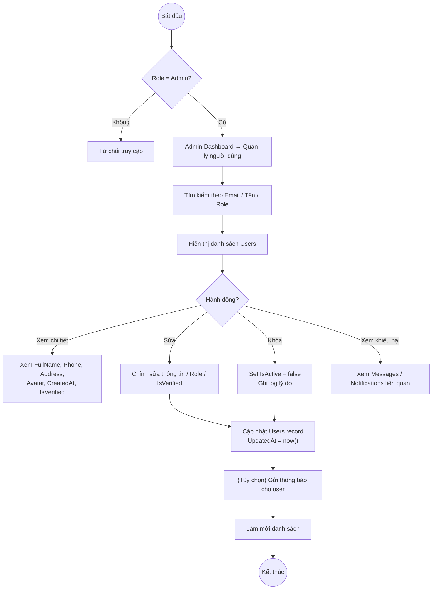